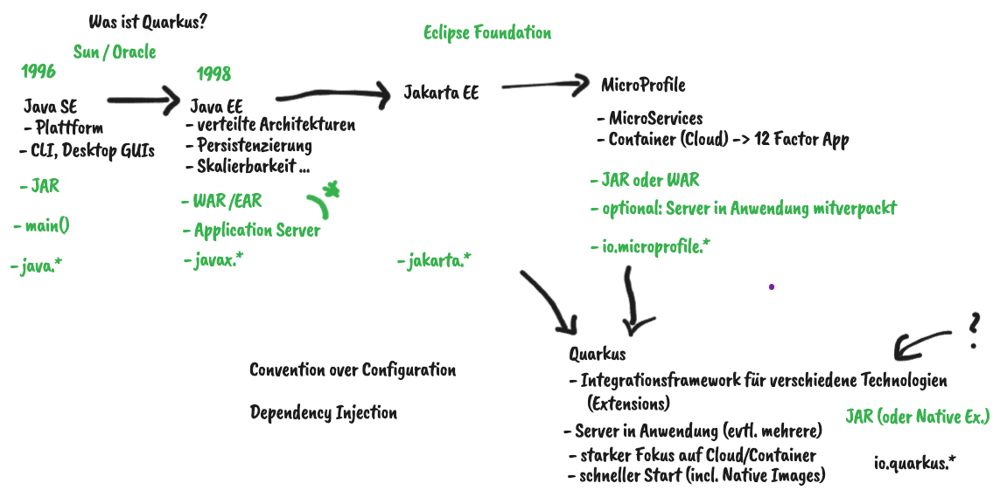
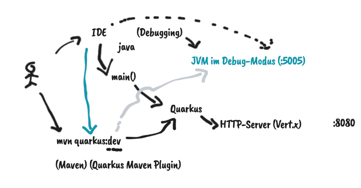
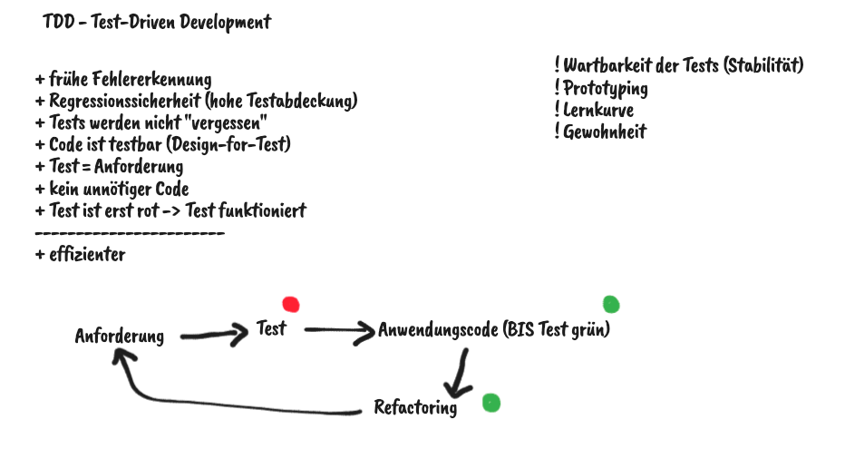
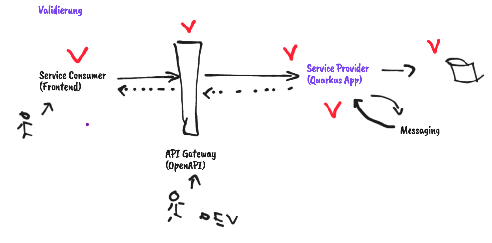
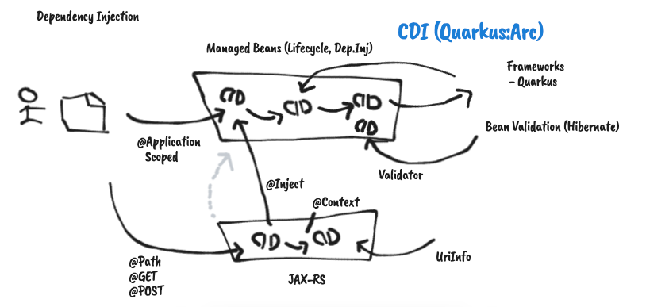
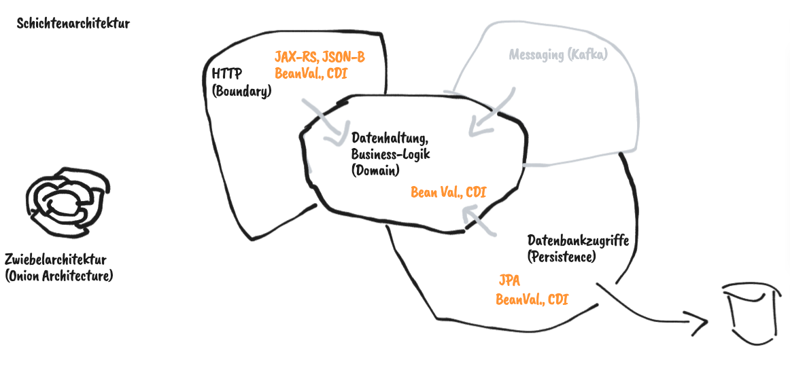
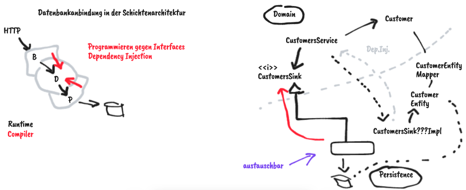
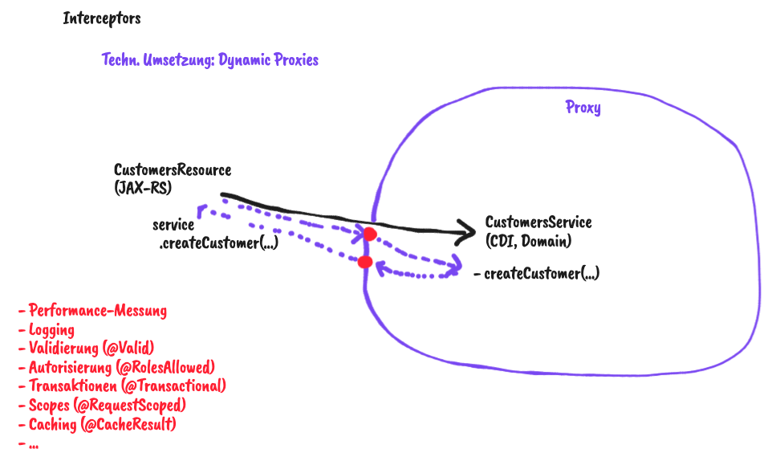

# Übersichten

## Technische Einordnung

## Debugging

https://www.baeldung.com/quarkus-debug-apps

## Testen

## Validierung

## Dependency Injection

https://quarkus.io/guides/cdi-reference

## Layers

## Interceptors

